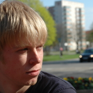

About me
========

	 

My name is Albert Cervin and I am currently studying a 
Master of Science in <a href="http://medieteknik.nu/" rel="external" title="Media technology">
Media technology</a> at Linköping University. 
Currently living in Norrköping where the campus is located.

My main interests are game programming, 
computer graphics and also programming and computers in general. 
I spend my spare time working with a lot of small side-projects 
and some of them can be seen in the [portfolio](/portfolio/).

 

Follow Me
=========

